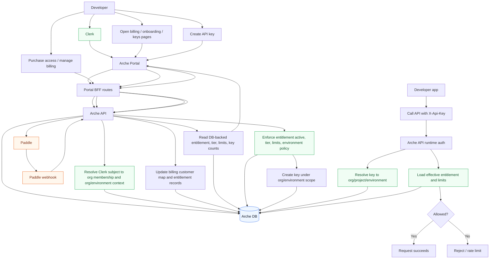

# Integration Model

This document describes how Clerk, Paddle, Arche API, and the production DB fit together for developer authentication, billing, API key creation, and runtime authorization.

## Core Model

- Clerk proves user identity for portal access.
- Arche API maps the Clerk user to Arche org membership and org/environment context.
- Paddle drives billing events, but is not consulted live on each API request.
- Arche DB is the source of truth for org membership, billing customer mappings, entitlements, API keys, and effective limits.
- Runtime API access uses `X-Api-Key`, not the Clerk session.

## Sequence Diagram

```text
Developer
  |
  | 1. Sign in
  v
Clerk
  |
  | 2. Session cookie / identity proof
  v
Arche Portal (Next.js)
  |
  | 3. Authenticated BFF call with Clerk session
  v
Arche API
  |
  | 4. Resolve Clerk subject -> org membership -> org/environment context
  | 5. Read Arche DB for membership / entitlement / key scope
  v
Arche DB

Purchase path
-------------

Developer
  |
  | 6. Click "Purchase access" / "Manage billing"
  v
Arche Portal BFF
  |
  | 7. POST billing action as authenticated user/org
  v
Arche API
  |
  | 8. Create or look up Paddle customer mapped to org/environment
  v
Paddle
  |
  | 9. Checkout / subscription change completes
  v
Paddle Webhook
  |
  | 10. Event sent to backend webhook
  v
Arche API
  |
  | 11. Update billing customer map / entitlement rows
  v
Arche DB

Portal authorization path
-------------------------

Developer
  |
  | 12. Open portal pages
  v
Arche Portal
  |
  | 13. Call self-serve access / billing / keys endpoints
  v
Arche API
  |
  | 14. Read DB-backed org/environment entitlement state
  v
Arche DB
  |
  | 15. Return status, tier, limits, key counts
  v
Arche Portal

Portal UX result:
- show purchase required or active entitlement
- show whether key creation appears allowed
- show existing keys and limits

Important:
- This is UX gating only.
- Backend still enforces entitlement and limits on create/revoke/use.

API key creation path
---------------------

Developer
  |
  | 16. Create API key in portal
  v
Arche Portal BFF
  |
  | 17. Authenticated create-key request
  v
Arche API
  |
  | 18. Re-resolve org/environment context
  | 19. Enforce entitlement active, tier, limits, environment policy
  | 20. Create key under org/environment scope
  v
Arche DB

Result:
- key belongs to Arche org/environment
- not to raw Clerk identity alone

Runtime API request path
------------------------

Developer App
  |
  | 21. Call API with X-Api-Key
  v
Arche Data/Control Plane API
  |
  | 22. Resolve key -> org/project/environment
  | 23. Read effective entitlement / tier / limits from DB
  | 24. Allow, rate-limit, or reject request
  v
Arche DB

Important:
- No live Paddle lookup here.
- Paddle only influences runtime auth after webhook-driven DB updates.
```

## Mermaid Diagram



## Mental Model

- `Clerk -> identity`
- `Arche org membership -> authorization scope`
- `Paddle -> billing events`
- `Arche DB -> source of truth`
- `X-Api-Key -> runtime access`
